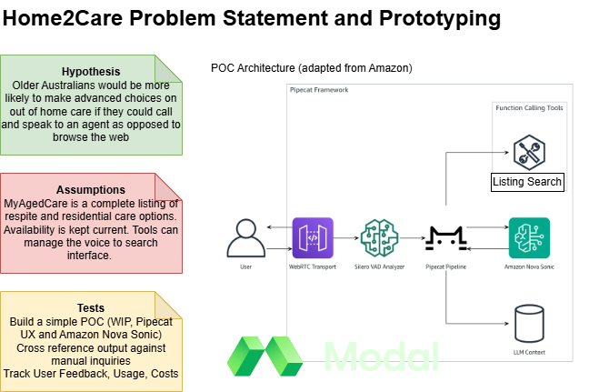

# Home2Stay

A voice agent to help older Australians explore out of home care before they need it. Contributions from the Sydney Build Community are welcome!

## Project Structure

```
.
├── README.md
├── prototyping
│   ├── data # for data extraction development, presently using playwright
│   │   ├── aged_care_providers_Sydney NSW 2000_agedCareHomes.csv # outputs
│   │   ├── aged_care_providers_Sydney NSW 2000_agedCareHomes.json
│   │   ├── requirements.txt
│   │   ├── scraper.py
│   │   └── search_result.html # starter html for scraper dev
│   └── speechagent # for speech agent development
│       ├── requirements.txt
│       └── test_setup.py # confirms setup is ok
└── static # for images and other assets
    └── home2stay.png
```

## Proof of Concept
- Working to test the assumptions ASAP using the Amazon starter code and bedrock framework.
- Will look into Modal for deployment of the pipecat app UX 
- An open question regarding how to best integrate this with a phone number



## Contributions Welcome
- I'll be setting up a weekly build session on Wednesday nights 7:30pm AEST, starting May 28th
- Let me know if you'd like to join in - you can reach out via [linkedin](https://www.linkedin.com/in/geoffreypidcock/) or [email](mailto:geoff@mmetrics.ai)
